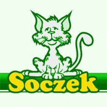

# Soczek - Strona internetowa kliniki weterynaryjnej

    

## Spis treści

* [Opis projektu](#opis-projektu)
* [Technologie](#technologie)
* [Funkcje](#funkcje)
* [Kontrybutorzy](#kontrybutorzy)

## Opis projektu

Strona internetowa kliniki weterynaryjnej *Soczek* umożliwia właścicielom zwierząt łatwy dostęp do zapoznania się z proponowanymi usługami kliniki, aktualnymi ogłoszeniami oraz kontaktu z kliniką.
Personel kliniki posiada dostęp do panelu administratora, pozwalający na proste i efektywne zarządzanie zasobami aplikacji webowej.
 Strona została stworzona z wykorzystaniem nowoczesnych technologii, zapewniając wysoką wydajność, bezpieczeństwo i przyjazny interfejs użytkownika.

## Technologie

Projekt został zaprojektowany wykorzystując następujące technologie:

- **Laravel 11**: Framework PHP, który stanowi podstawę aplikacji, umożliwiając szybki rozwój backendu oraz zarządzanie logiką biznesową.
- **TailwindCSS**: Narzędzie do stylizacji, które umożliwia tworzenie responsywnych i nowoczesnych interfejsów użytkownika.
- **Livewire**: Biblioteka dla Laravel, która umożliwia tworzenie dynamicznych interfejsów użytkownika bez konieczności pisania kodu JavaScript.
- **Laravel Filament**: Zestaw narzędzi do zarządzania panelem administracyjnym, który pozwala na łatwe zarządzanie zasobami aplikacji.
- **MySQL**: System zarządzania relacyjnymi bazami danych, który przechowuje wszystkie dane aplikacji.

## Funkcje

- **Zarządzanie wizytami**: Użytkownicy mogą rezerwować wizyty dla swoich zwierząt oraz przeglądać historię wizyt.
- **Panel administracyjny**: Umożliwia pracownikom kliniki zarządzanie danymi pacjentów, wizytami oraz dostępem do zasobów aplikacji.
- **Responsywny design**: Strona dostosowuje się do różnych rozmiarów ekranów, zapewniając optymalne doświadczenie użytkownika na urządzeniach mobilnych i stacjonarnych.

## Kontrybutorzy

- kfyda
- Rolfer150
